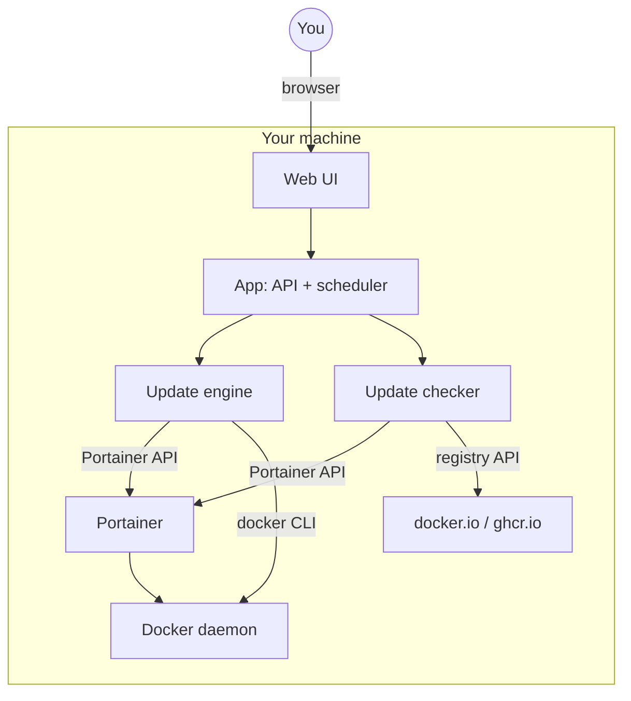
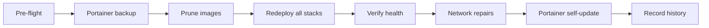
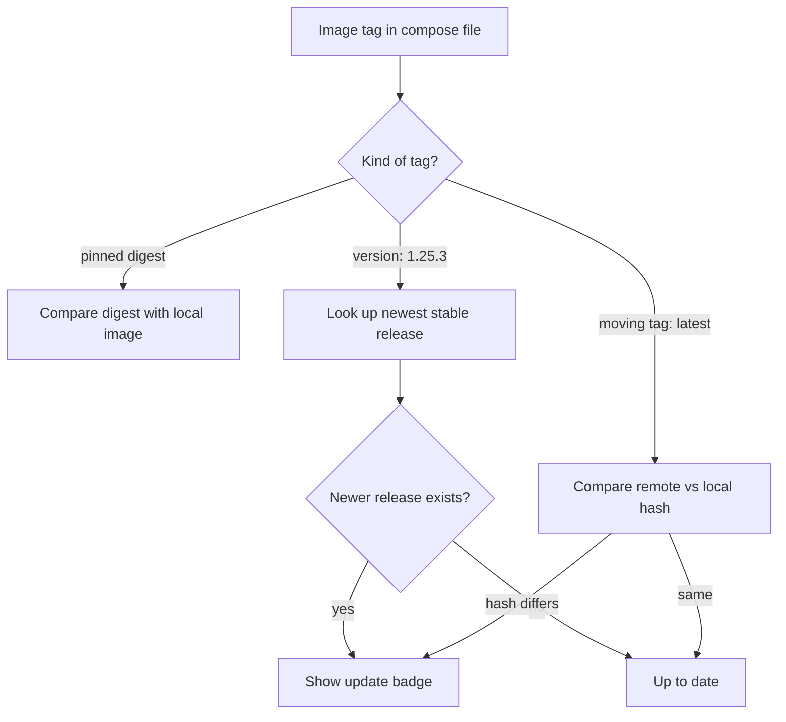

# Portainer Update Service

A web-based update manager for **Portainer**: it watches your stacks, shows you
when newer container images are available, updates everything on a schedule or
at the click of a button — and lets you pin individual services to a specific
version whenever you want stability over novelty.

Everything runs on your own machine. No cloud, no accounts, no telemetry.

## What it does

- **Dashboard** — one glance tells you which stacks have updates waiting, what
  the last run did, and when the next one is scheduled
- **Update checks** — compares the images your stacks use against docker.io and
  ghcr.io, with a badge per service
- **One-click or scheduled updates** — pull new images, recreate containers,
  verify everything came back healthy (backups are taken before any update)
- **Version pinning** — keep a service on a known-good version, or pick a new
  one from the registry's tag list
- **Live progress** — while an update runs, you see the current phase and a
  live log; afterwards every run is recorded with its log and duration
- **Fail-safe update sequence** — backup → prune → redeploy all stacks →
  verify → fix up networks → update Portainer itself (optional)

## Quick start

You need: a running **Portainer** and an **API key** for it
(Portainer → *Settings → API keys → Add API key*).

### Option A: run directly on the Docker host (Python)

```bash
git clone https://github.com/<your-account>/Portainer-Update-Service.git
cd Portainer-Update-Service
python3 -m venv .venv
.venv/bin/pip install -r requirements.txt
cp config/config.example.yaml config/config.yaml
nano config/config.yaml          # enter Portainer URL + API key
.venv/bin/python run.py
```

Open `http://127.0.0.1:8090` in your browser.

Prefer clicking over config files? Leave `config.yaml` almost empty and enter
URL + key in the web UI instead (**Settings → Test connection → Save**) — the
first update check starts automatically.

To keep it running after a reboot, register it as a systemd service:

```ini
# /etc/systemd/system/update-service.service
[Unit]
Description=Portainer Update Service
After=network-online.target docker.service

[Service]
User=youruser
WorkingDirectory=/opt/Portainer-Update-Service
ExecStart=/opt/Portainer-Update-Service/.venv/bin/python run.py
Restart=on-failure
RestartSec=10

[Install]
WantedBy=multi-user.target
```

```bash
sudo systemctl enable --now update-service
```

### Option B: run as a Docker container

```bash
git clone https://github.com/<your-account>/Portainer-Update-Service.git
cd Portainer-Update-Service
# edit docker-compose.yml: set PUS_PORTAINER_URL and PUS_PORTAINER_API_KEY
docker compose up -d --build
```

The compose file mounts the host's docker socket so pruning, backups and the
Portainer self-update work inside the container.

### Option C: deploy as a Portainer stack

Since the app manages Portainer through its API, it can manage *itself* like
any other stack:

1. In Portainer: **Stacks → Add stack → Repository**
2. Point it at this GitHub repository (build method: **Dockerfile**,
   compose path: `docker-compose.yml`)
3. Add the environment variables `PUS_PORTAINER_URL`, `PUS_PORTAINER_API_KEY`
   and `PUS_LISTEN_HOST=0.0.0.0` under **Environment variables**
4. Deploy — the image is built on your host

The app detects the stack it is running in and updates itself last in every
run (after finalizing its history), so deploying it this way is safe.

## Using the app

**First launch**

1. Open the UI. If it shows *"Not connected"*, go to **Settings**, enter your
   Portainer URL and API key, hit **Test connection** (should answer with your
   Portainer version), then **Save**
2. The first update check starts automatically — within a minute the Stacks
   tab shows every stack with per-service badges:
   - 🟢 **current** — nothing to do
   - 🟡 **update: 1.28.3** — a newer version is available (the number is the
     newest release; the badge tooltip shows how long it has been waiting)
   - ⚪ **not verified** — hover for the reason (usually: registry rate
     limit or a private image)

**Checking for updates**

- "Check updates" (top right) refreshes all badges on demand
- The scheduler re-checks automatically — the interval is in **Settings**
  (default: weekly)

**Updating**

- **Run update** performs the full sequence: backup Portainer → prune unused
  images → redeploy every stack → verify → repair networks → (optionally)
  update Portainer itself. You'll see a progress banner with the current phase
  and a live log while it runs.
- **Update a single stack**: Stacks tab → *manage* → "Update stack now"
- **Pin a version**: Stacks tab → *Version* → "Show available tags" → click a
  tag → "Apply & redeploy". This edits the stack's compose file permanently.

**History**

Every run is recorded with steps, duration and its full log (History tab).
Charts show durations and success/failure over time.

## Configuration

Most settings can be edited in the UI (**Settings** tab). Everything is
validated and written atomically to `config/config.yaml` — which never gets
committed (see `.gitignore`).

| Key | Default | Description |
|---|---|---|
| `portainer_url` | — | Portainer base URL |
| `portainer_api_key` | — | API key (never returned by the API — masked as `***`) |
| `portainer_endpoint_id` | auto | Only needed if hostname auto-detection picks the wrong endpoint |
| `update_interval_hours` | 168 | Interval for checks + full updates (168 = weekly) |
| `tls_verify` | false | Verify Portainer's TLS certificate |
| `max_parallel_deploys` | 3 | How many stacks redeploy at the same time |
| `deploy_wait_time` | 300 | Seconds to wait for containers to become healthy |
| `keep_backups` | 5 | How many Portainer backups to keep |
| `portainer_compose_dir` | — | Host path to Portainer's own compose dir — enables the Portainer self-update step |
| `check_cache_minutes` | 30 | How long registry results are cached |
| `listen_host` | 127.0.0.1 | Bind address — keep localhost unless you front it with a proxy |
| `listen_port` | 8090 | Web UI port |
| `auth_token` | — | If set: every mutating API call needs `Authorization: Bearer <token>` |
| `notify_webhook` | — | Optional: POST target for failure notifications (ntfy-compatible) |

### Network integrity repairs

Updating containers involves network prunes, and network prunes occasionally
strand things — a running container can end up with a gateway address that no
longer exists, or an externally-managed container can lose its network
endpoint. The update run repairs this automatically:

- **Built-in**: containers with a stale host-gateway mapping
  (`extra_hosts: host.docker.internal` baked in at container creation) are
  detected and their stack is recreated with the fresh gateway.
- **Optional custom rules**: if a compose-managed container must reach a
  container managed by *something else* (e.g. a reverse proxy fronting an
  externally-managed app), define a repair rule in `config.yaml`. Format and
  a worked example are documented inline in `config/config.example.yaml`.

Disable with `repairs.enabled: false`.

## Security notes

- The UI has **no login**. It binds to `127.0.0.1` by default — access it via
  SSH tunnel (`ssh -L 8090:localhost:8090 your-host`) or put an authenticated
  reverse proxy in front. If you make the port reachable, set `auth_token`:
  it gates every mutating endpoint (update, prune, version pinning, settings).
- `tls_verify: false` accepts self-signed Portainer certificates (common on
  home networks). Set `true` if Portainer has a valid certificate.
- The API key is stored in plaintext in `config.yaml` — keep that file on the
  host and never commit it. It is never returned by the API.
- No telemetry, no outbound calls except to your Portainer and the image
  registries you already use.

## For the curious: how it works

### The components



### What happens during a full update run



### How an update is detected



Safety details worth knowing:

- **One job at a time.** The scheduler and every UI action share a single job
  gate, so a manual prune can never collide with a running update.
- **Reads never block.** The stack overview always answers instantly from
  cache; fresh registry checks happen in the background.
- **Self-update safe.** If the app is deployed as a Portainer stack, it
  recognizes its own stack and redeploys it after finalizing the run.
- **Failure backoff.** If runs keep failing, the scheduler backs off instead
  of hammering your setup, and can notify a webhook.

## API (for scripting)

| Method | Path | Description |
|---|---|---|
| GET  | `/api/status` | State, last run, current job, next run, update counts |
| GET  | `/api/stacks` | Stacks with per-service check results |
| GET  | `/api/stacks/<id>` | Stack detail + compose content |
| POST | `/api/stacks/<id>/image` | Pin version `{"service":"web","image":"nginx:1.27.3"}` |
| POST | `/api/stacks/<id>/redeploy` | Redeploy one stack |
| POST | `/api/check` | Force update check |
| POST | `/api/update` | Trigger full update run |
| POST | `/api/prune` | Prune images + build cache now |
| GET  | `/api/runs/current` | Live progress of the active job |
| GET  | `/api/runs/<id>/log` | Run log (plain text) |
| GET  | `/api/versions?image=nginx` | Available tags |
| GET  | `/api/history` | Last 200 runs |
| GET/POST | `/api/settings` | View/change config |
| POST | `/api/test` | Test the Portainer connection |
| GET  | `/healthz` | Liveness + scheduler heartbeat |

Example:

```bash
curl -X POST -H "Authorization: Bearer $TOKEN" https://your-host:8090/api/update
```

## Project layout

```
├── app/
│   ├── main.py        REST API, auth gate, healthz
│   ├── updater.py     the update pipeline
│   ├── checker.py     image collection + update detection
│   ├── dockerhub.py   registry client (digests, versions, caching)
│   ├── portainer.py   Portainer API client
│   ├── compose.py     compose parsing + editing
│   ├── scheduler.py   background scheduler
│   ├── jobs.py        shared job gate
│   ├── history.py     run logs + history
│   └── config.py      validated yaml config
├── ui/index.html      the web UI (single file, no build step)
├── config/config.example.yaml
├── docker-compose.yml
├── Dockerfile
├── requirements.txt
└── run.py             entry point
```

## License

MIT