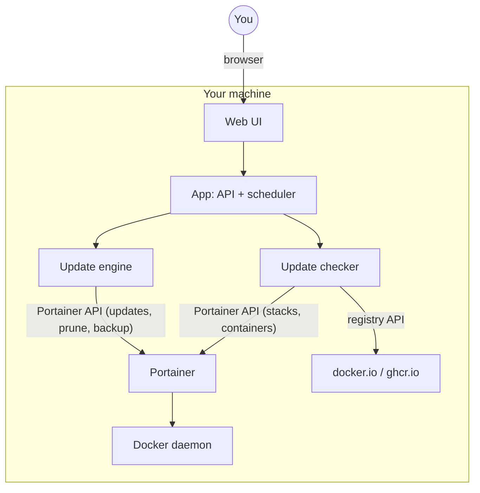
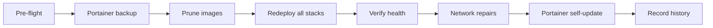
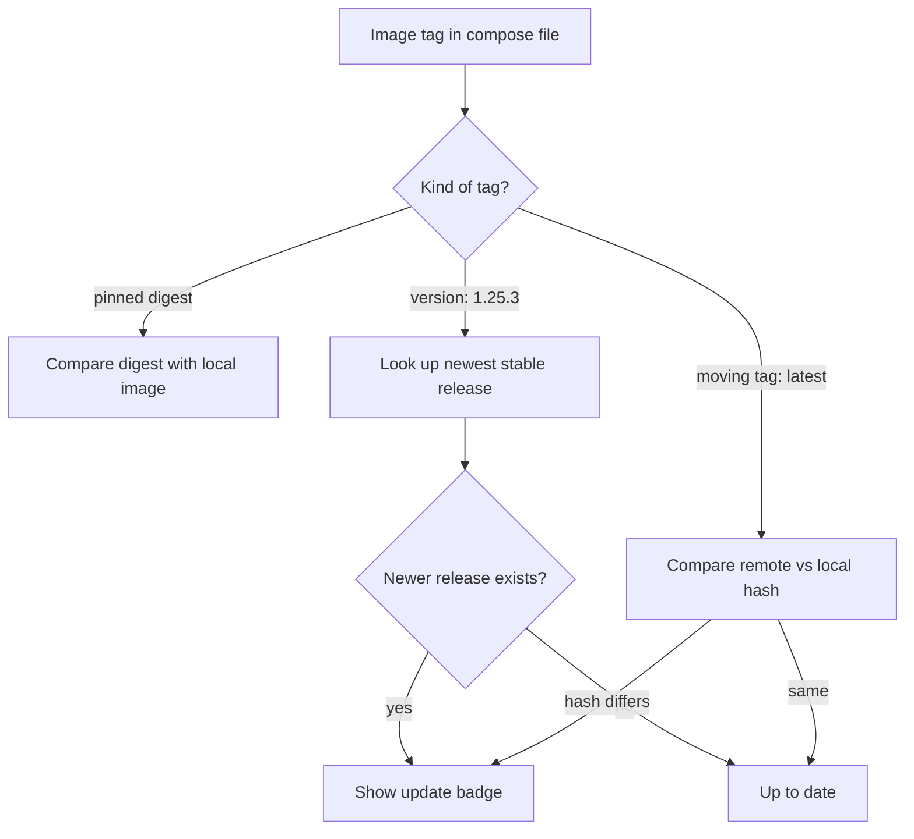

# Portainer Update Service

A web-based update manager for **Portainer** — speaking **only** to the
Portainer API: it watches your stacks, shows you when newer container images
are available, updates everything on a schedule or at the click of a button —
and lets you pin individual services to a specific version whenever you want
stability over novelty.

Deployed as a **Portainer stack**. No docker CLI inside the container, no
docker socket scraping, no host-side tooling.

Everything runs on your own machine. No cloud, no accounts, no telemetry.

## What it does

- **Dashboard** — one glance tells you which stacks have updates waiting, what
  the last run did, and when the next one is scheduled
- **Inventory** — unused images (with reclaimable MB) and unused networks at
  a glance, plus how much your automatic cleanups reclaimed in the last 30 days
- **Update checks** — compares the images your stacks use against docker.io and
  ghcr.io, with a badge per service
- **One-click or scheduled updates** — pull new images, recreate containers,
  verify everything came back healthy (a Portainer datastore backup is taken
  before any update)
- **Version pinning** — keep a service on a known-good version, or pick a new
  one from the registry's tag list
- **Live progress** — while an update runs, you see the current phase and a
  live log; afterwards every run is recorded with its log and duration
- **Fail-safe update sequence** — backup → prune → redeploy all stacks →
  verify → fix up networks → update Portainer itself (optional)

## Quick start

You need: a running **Portainer** and an **API key** for it
(Portainer → *Settings → API keys → Add API key*). The key needs **admin**
rights (prune + backup routes are admin-only).

### Deploy as a Portainer stack (the way this app is meant to run)

1. In Portainer: **Stacks → Add stack → Repository**
2. Point it at this GitHub repository (build method: **Dockerfile**,
   compose path: `docker-compose.yml`)
3. Add these **environment variables**:

   | Variable | Example | Description |
   |---|---|---|
   | `PUS_LISTEN_HOST` | `0.0.0.0` | Required in a container |
   | `TZ` | `Europe/Berlin` | Timezone for the schedule |
   | `PUS_AUTH_TOKEN` | `change-me` | Recommended: protects all UI/API actions |

4. Deploy — the image is built on your host

5. Open the web UI and finish setup (Settings tab):

   1. Enter your **Portainer URL** (from the container's perspective, e.g.
      `https://portainer:9443` — the app joins the network your Portainer is
      on, see the compose template below) and your **API key**
   2. Hit **Scan** → pick the endpoint that runs your stacks from the list
   3. Hit **Test connection** → should answer with your Portainer version
   4. **Save** — the first update check starts automatically

Everything is persisted in the mounted config volume and survives container
rebuilds. No config file editing needed.

**Why no docker socket mount?** The app talks exclusively to the Portainer
API — it needs no host-side docker access at all. Everything (updates, prune,
backups, repairs) happens through Portainer.

### Compose template

If you prefer to configure the Portainer connection via env vars instead of
the web UI (both work; UI settings persist into the config volume either way):

```yaml
services:
  update-service:
    build: https://github.com/<your-account>/Portainer-Update-Service.git
    container_name: update-service      # fixed name - handy for firewall rules
    restart: unless-stopped             # auto-restart on reboot/crash
    logging:
      driver: json-file                 # default docker logging driver
      options:
        max-size: "10m"                 # rotate log file at 10 MB...
        max-file: "3"                   # ...keep max 3 files = ~30 MB log ceiling
    ports:
      - "8090:8090"                     # <host-port>:<container-port> - change left side if 8090 is taken
    environment:
      PUS_LISTEN_HOST: "0.0.0.0"        # required in a container (0.0.0.0 = reachable from outside)
      TZ: "Europe/Berlin"               # timezone for the schedule (your local TZ)
      # optional — configure in the UI instead:
      # PUS_PORTAINER_URL: "https://portainer:9443"       # Portainer URL as seen from THIS container
      # PUS_PORTAINER_API_KEY: "ptr_xxx"                  # Portainer admin API key
      # PUS_PORTAINER_ENDPOINT_ID: "1"                    # only if Scan can't auto-detect
      # PUS_AUTH_TOKEN: "change-me"                       # recommended if UI is reachable from the network
      # PUS_NOTIFY_WEBHOOK: "https://ntfy.sh/your-topic"  # push notification on failed update runs
    volumes:
      - /path/to/update-service/data:/app/data          # status/history/run logs/backups (PERSISTED)
      - /path/to/update-service/config:/app/config      # settings (PERSISTED across rebuilds)
```

No docker socket needed — the app talks exclusively to the Portainer API.

**Optional — Portainer self-update via compose-dir fallback:** only needed
when your Portainer is NOT deployed as a Portainer stack (the normal case —
Portainer manages the other stacks, it can't be its own client; e.g. started
with plain `docker compose up` or `docker run`). If it IS a Portainer stack,
use the `include_portainer` setting instead (see "Updating Portainer itself"
below). Mount Portainer's compose dir READ-ONLY:

```yaml
    volumes:
      - /path/to/portainer/docker-compose:/host-portainer:ro  # Portainer's own compose dir
      - /var/run/docker.sock:/var/run/docker.sock             # compose pull/up needs the daemon
```

(with `portainer_compose_dir` = `/host-portainer` in Settings — the app then
self-updates Portainer with `docker compose pull && docker compose up -d`
in that directory; the `:ro` mount is sufficient, compose only reads the
yml and talks to the daemon)

Adjust: host port (`8090:8090`), data/config paths, and — if your Portainer
runs as a container — join the network your Portainer is on (so the app can
reach `https://portainer:9443` directly):

```yaml
    networks:
      - portainer-net   # example: the network Portainer itself uses

networks:
  portainer-net:
    external: true
    name: <the-network-your-portainer-runs-on>
```

**All environment variables (reference):**

| Variable | Default | Description |
|---|---|---|
| `PUS_LISTEN_HOST` | `127.0.0.1` | Bind address — **must be `0.0.0.0` in containers** |
| `PUS_LISTEN_PORT` | `8090` | Web UI port inside the container |
| `TZ` | `UTC` | Timezone for the schedule (e.g. `Europe/Berlin`) |
| `PUS_PORTAINER_URL` | — | Portainer base URL (alternative: web UI setup) |
| `PUS_PORTAINER_API_KEY` | — | Portainer API key (alternative: web UI setup) |
| `PUS_PORTAINER_ENDPOINT_ID` | auto | Endpoint ID — only if endpoint auto-detect picks wrong |
| `PUS_AUTH_TOKEN` | — | If set: mutating API/UI calls need `Authorization: Bearer <token>` |
| `PUS_NOTIFY_WEBHOOK` | — | POST target for failure notifications (ntfy-compatible) |
| `PUS_UPDATE_INTERVAL_HOURS` | 168 | Interval mode only — checks + updates every N hours |
| `PUS_UPDATE_SCHEDULE_MODE` | interval | `interval` / `daily` / `weekly` |
| `PUS_UPDATE_SCHEDULE_TIME` | 03:30 | Run time (HH:MM, server-local) for daily/weekly |
| `PUS_UPDATE_SCHEDULE_DAY` | 0 | Weekday for weekly mode (0 = Monday) |
| `PUS_TLS_VERIFY` | false | Verify Portainer's TLS certificate |
| `PUS_MAX_PARALLEL_DEPLOYS` | 3 | Parallel stack redeploys |
| `PUS_DEPLOY_WAIT_TIME` | 300 | Seconds to wait for containers to become healthy |
| `PUS_KEEP_BACKUPS` | 5 | How many Portainer backups to keep |
| `PUS_CHECK_CACHE_MINUTES` | 30 | Registry result cache TTL |
| `PUS_SELF_STACK_NAME` | auto | Portainer stack name of this app (self-update) |
| `PUS_INCLUDE_PORTAINER` | false | Mode A: also update Portainer as a Portainer stack (last step) |
| `PUS_PORTAINER_COMPOSE_DIR` | — | Mode B: container path of Portainer's compose dir (e.g. `/host-portainer`) for plain-compose setups |

Env vars **override** UI settings — configure everything in the UI and leave
the env minimal (recommended), or set them here to lock values in. Any
`PUS_*` var not listed (e.g. `PUS_REPAIRS_*`) is not supported via env;
use `config/config.yaml` for the repair-rules section instead.

## Updating Portainer itself (optional)

Portainer is by definition **never a Portainer stack** unless you deploy it
as one — the app supports both setups, auto-selected by which setting you use:

**Mode A — Portainer deployed as a Portainer stack** (`include_portainer`):

1. Deploy the app **as a Portainer stack** (see above) — it detects its own
   stack and updates itself last, after finalizing its history
2. In the UI: **Settings → "Also update Portainer"** enable + enter the
   Portainer stack's name under **"Self stack name"**
3. Done — every update run then pulls the newest Portainer image and
   redeploys it through the Portainer API

**Mode B — Portainer as a plain compose project** (`portainer_compose_dir`,
the normal setup): Portainer manages the other stacks, so it can't be its
own client. Mount Portainer's compose dir READ-ONLY plus the docker socket:

```yaml
    volumes:
      - /path/to/portainer-compose:/host-portainer:ro  # Portainer's own compose dir
      - /var/run/docker.sock:/var/run/docker.sock      # compose pull/up needs the daemon
```

Set **Settings → "Portainer compose dir"** to `/host-portainer`. The app
then updates Portainer with `docker compose pull && docker compose up -d`
in that directory (the `:ro` mount is sufficient — compose only reads the
yml, the daemon does the work; the image ships the compose plugin).

## Using the app

**Dashboard**

- Update badges per stack/service (🟢 current, 🟡 update available with the
  newest version, ⚪ not verified — hover for the reason)
- **Reclaimable** card: unused images (+MB) and unused networks
- **Reclaimed (30d)** card: what your automatic cleanups freed up
- Next scheduled run + server time (the schedule refers to this clock)

**Checking for updates**

- "Check updates" (top right) refreshes all badges on demand
- The scheduler re-checks automatically (configure under **Settings**:
  interval, or daily/weekly at a specific time)

**Updating**

- **Run update** performs the full sequence: backup Portainer → prune unused
  images → redeploy every stack → verify → repair networks → (optionally)
  update Portainer itself. You'll see a progress banner with the current phase
  and a live log while it runs.
- **Update a single stack**: Stacks tab → *manage* → "Update stack now"
- **Pin a version**: Stacks tab → *manage* → *Version* → "Show available
  tags" → click a tag → "Apply & redeploy". This edits the stack's compose
  file permanently.

**History**

Every run is recorded with steps, duration and its full log (History tab).
Charts show durations and success/failure over time, plus the disk space your
automatic cleanups reclaimed in the last 30 days.

## Configuration

Most settings can be edited in the UI (**Settings** tab). Everything is
validated and written atomically to `config/config.yaml` in the mounted
config volume — which never gets committed (see `.gitignore`).

| Key | Default | Description |
|---|---|---|
| `portainer_url` | — | Portainer base URL |
| `portainer_api_key` | — | API key, **admin** rights required (never returned by the API — masked as `***`) |
| `portainer_endpoint_id` | auto | Use **Scan** in Settings to pick from a list (recommended) |
| `update_schedule_mode` | interval | `interval` / `daily` / `weekly` — see below |
| `update_schedule_time` | 03:30 | Run time in server-local time (HH:MM) |
| `update_schedule_day` | 0 | Weekday for weekly mode (0 = Monday) |
| `update_interval_hours` | 168 | Interval — only used in `interval` mode |
| `tls_verify` | false | Verify Portainer's TLS certificate |
| `max_parallel_deploys` | 3 | How many stacks redeploy at the same time |
| `deploy_wait_time` | 300 | Seconds to wait for containers to become healthy |
| `keep_backups` | 5 | How many Portainer backups to keep |
| `include_portainer` | false | Also update Portainer itself (last step of every run) |
| `self_stack_name` | auto | Portainer stack name of this app — enables self-update-last |
| `check_cache_minutes` | 30 | How long registry results are cached |
| `listen_host` | 127.0.0.1 | Bind address — must be `0.0.0.0` in containers |
| `listen_port` | 8090 | Web UI port |
| `auth_token` | — | If set: every mutating API call needs `Authorization: Bearer <token>` |
| `notify_webhook` | — | Optional: POST target for failure notifications (ntfy-compatible) |

### Schedule modes

- **Interval** — every N hours (checks + full updates)
- **Daily at time** — e.g. every night at 03:30 (server time, shown in Settings)
- **Weekly at time** — e.g. every Monday at 04:00

### Network integrity repairs

Updating containers involves network prunes, and network prunes occasionally
strand things — a running container can end up with a gateway address that no
longer exists, or an externally-managed container can lose its network
endpoint. The update run repairs this automatically:

- **Built-in**: containers with a stale host-gateway mapping
  (`extra_hosts: host.docker.internal` baked in at container creation) are
  detected and their stack is recreated with the fresh gateway.
- **Optional custom rules**: if a compose-managed container must reach a
  container managed by *something else* (e.g. a reverse proxy fronting an
  externally-managed app), define a repair rule in `config.yaml`. Format and
  a worked example are documented inline in `config/config.example.yaml`.

Disable with `repairs.enabled: false`.

## Security notes

- The UI has **no login**. In containers the app binds to `0.0.0.0`
  (`PUS_LISTEN_HOST`) — set `auth_token` to gate every mutating endpoint
  (update, prune, version pinning, settings) and/or put an authenticated
  reverse proxy in front.
- `tls_verify: false` accepts self-signed Portainer certificates (common on
  home networks). Set `true` if Portainer has a valid certificate.
- The API key is stored in plaintext in `config.yaml` (mounted config volume)
  and never returned by the API. Never commit it.
- The Portainer API key must have **admin** rights (prune + backup routes are
  admin-only in Portainer).
- No telemetry, no outbound calls except to your Portainer and the image
  registries you already use.

## For the curious: how it works

### The components



### What happens during a full update run



### How an update is detected



Safety details worth knowing:

- **One job at a time.** The scheduler and every UI action share a single job
  gate, so a manual prune can never collide with a running update.
- **Reads never block.** The stack overview always answers instantly from
  cache; fresh registry checks happen in the background.
- **Self-update safe.** The app recognizes its own stack (and Portainer's,
  with `include_portainer`) and redeploys them after finalizing the run.
- **Failure backoff.** If runs keep failing, the scheduler backs off instead
  of hammering your setup, and can notify a webhook.

## API (for scripting)

| Method | Path | Description |
|---|---|---|
| GET  | `/api/status` | State, last run, current job, next run, update counts |
| GET  | `/api/stacks` | Stacks with per-service check results |
| GET  | `/api/stacks/<id>` | Stack detail + compose content |
| POST | `/api/stacks/<id>/image` | Pin version `{"service":"web","image":"nginx:1.27.3"}` |
| POST | `/api/stacks/<id>/redeploy` | Redeploy one stack |
| POST | `/api/check` | Force update check |
| POST | `/api/update` | Trigger full update run |
| POST | `/api/prune` | Prune images + build cache now |
| GET  | `/api/inventory` | Unused images/networks + reclaimable MB |
| GET  | `/api/runs/current` | Live progress of the active job |
| GET  | `/api/runs/<id>/log` | Run log (plain text) |
| GET  | `/api/versions?image=nginx` | Available tags |
| GET  | `/api/endpoints` | List Portainer endpoints (Scan) |
| GET  | `/api/history` | Last 200 runs + 30d prune stats |
| GET/POST | `/api/settings` | View/change config |
| POST | `/api/test` | Test the Portainer connection |
| GET  | `/healthz` | Liveness + scheduler heartbeat |

Example:

```bash
curl -X POST -H "Authorization: Bearer $TOKEN" https://your-host:8090/api/update
```

## Project layout

```
├── app/
│   ├── main.py        REST API, auth gate, healthz
│   ├── updater.py     the update pipeline
│   ├── checker.py     image collection + update detection
│   ├── dockerhub.py   registry client (digests, versions, caching)
│   ├── portainer.py   Portainer API client (incl. exec/prune/backup)
│   ├── compose.py     compose parsing + editing
│   ├── scheduler.py   background scheduler
│   ├── jobs.py        shared job gate
│   ├── history.py     run logs, history + prune stats
│   └── config.py      validated yaml config
├── ui/index.html      the web UI (single file, no build step)
├── config/config.example.yaml
├── docker-compose.yml
├── Dockerfile
├── requirements.txt
└── run.py             entry point
```

## License

MIT